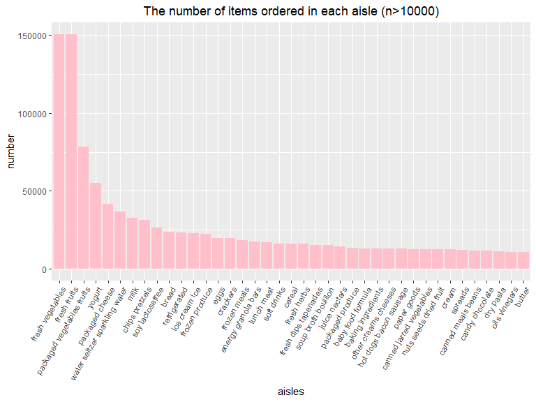

p8105\_HW3\_yl4360
================
Yiyang Liu

``` r
library(p8105.datasets)
library(tidyverse)
library(patchwork)
data("instacart")
```

# Problem 1

## Short discription

  - **The size and structure of the data:** there are 1384617
    observations and 15 variables in the data. 11 variables are integer
    and 4 of them are character.

  - **Describing some key variables:**
    
      - `reordered`: 1 if this prodcut has been ordered by this user in
        the past, 0 otherwise
      - `order_dow`: the day of the week on which the order was placed
      - `eval_set`: which evaluation set this order belongs in *(Note
        that the data for use in this class is exclusively from the
        “train” `eval_set`)*

  - **Giving illustrative examples of observations:** For the 1st
    observation, order id is 1. It was ordered at 10 on Thursday and it
    is reordered 9 days after the prior order. The product name is
    Bulgarian Yogurt from department dairy eggs. The 1st order consists
    of 8 products. User 112108 ordered them.

  - **The number of aisles and the aisle that the most items are ordered
    from**: there are 134 aisles and the aisle that the most items are
    ordered from is fresh vegetables.

## Plot 1

Showing the number of items ordered in each
aisle.



According to the plot, the orders from fresh vegetables is the most and
butter is the least.

## Table 1

Showing the three most popular items in each of the aisles “baking
ingredients”, “dog food care”, and “packaged vegetables
fruits”.

| group                      | product\_name                                 | order\_times |
| :------------------------- | :-------------------------------------------- | -----------: |
| baking ingredients         | Light Brown Sugar                             |          499 |
| baking ingredients         | Pure Baking Soda                              |          387 |
| baking ingredients         | Cane Sugar                                    |          336 |
| dog food care              | Snack Sticks Chicken & Rice Recipe Dog Treats |           30 |
| dog food care              | Organix Chicken & Brown Rice Recipe           |           28 |
| dog food care              | Small Dog Biscuits                            |           26 |
| packaged vegetables fruits | Organic Baby Spinach                          |         9784 |
| packaged vegetables fruits | Organic Raspberries                           |         5546 |
| packaged vegetables fruits | Organic Blueberries                           |         4966 |

## Table 2

Showing the mean hour of the day at which Pink Lady Apples and Coffee
Ice Cream are ordered on each day of the week.

| product\_name    |  Sun |  Mon |  Tue |  Wed | Thur |  Fri |  Sat |
| :--------------- | ---: | ---: | ---: | ---: | ---: | ---: | ---: |
| Coffee Ice Cream | 13.8 | 14.3 | 15.4 | 15.3 | 15.2 | 12.3 | 13.8 |
| Pink Lady Apples | 13.4 | 11.4 | 11.7 | 14.2 | 11.6 | 12.8 | 11.9 |
