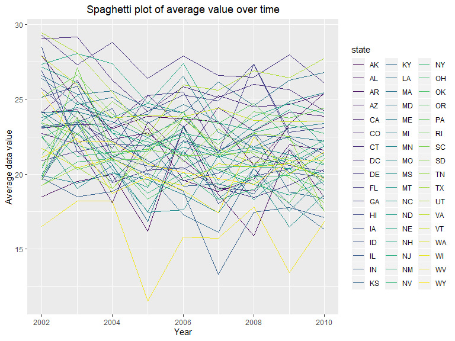

p8105\_HW3\_yl4360
================
Yiyang Liu

``` r
data("instacart")
data("brfss_smart2010")
```

# Problem 1

## Short discription

  - **The size and structure of the data:** there are 1384617
    observations and 15 variables in the data. 11 variables are integer
    and 4 of them are character.

  - **Describing some key variables:**
    
      - `reordered`: 1 if this prodcut has been ordered by this user in
        the past, 0 otherwise
      - `order_dow`: the day of the week on which the order was placed
      - `eval_set`: which evaluation set this order belongs in *(Note
        that the data for use in this class is exclusively from the
        “train” `eval_set`)*

  - **Giving illustrative examples of observations:** For the 1st
    observation, order id is 1. It was ordered at 10 on Thursday and it
    is reordered 9 days after the prior order. The product name is
    Bulgarian Yogurt from department dairy eggs. The 1st order consists
    of 8 products. User 112108 ordered them.

<!-- end list -->

``` r
aisle_level = 
  pull(instacart, aisle) %>% 
  as.factor() %>% 
  levels()
  
aisle_max = 
  instacart %>%
  group_by(aisle) %>%
  summarise(number = n()) %>%
  filter(number == max(number)) %>%
  select(aisle) %>%
  as.character()
```

  - **The number of aisles and the aisle that the most items are ordered
    from**: there are 134 aisles and the aisle that the most items are
    ordered from is fresh vegetables.

## Plot 1

Showing the number of items ordered in each
aisle.


According to the plot, it is hard to tell whether the orders from fresh
vegetables or the ones from fresh fruits is the most but the result from
coding is that the orders from fresh vegetables is the most. Therefore
we need further verify.

``` r
aisle_max_ver = 
  instacart %>% 
  group_by(aisle) %>% 
  summarise(number = n()) %>% 
  arrange(desc(number)) %>% 
  head(2)
```

It is verified that the orders from fresh vegetables is the most.

## Table 1

Showing the three most popular items in each of the aisles “baking
ingredients”, “dog food care”, and “packaged vegetables fruits”.

``` r
baking = 
  instacart %>%
  group_by(product_name) %>%
  filter(aisle == "baking ingredients") %>%
  summarise(order_times = n()) %>%
  arrange(desc(order_times)) %>%
  head(n = 3) %>%
  mutate(group = "baking ingredients") %>%
  select(group, everything())

dog = 
  instacart %>%
  group_by(product_name) %>%
  filter(aisle == "dog food care") %>%
  summarise(order_times = n()) %>%
  arrange(desc(order_times)) %>%
  head(n = 3) %>%
  mutate(group = "dog food care") %>%
  select(group, everything())

vege =
  instacart %>%
  group_by(product_name) %>%
  filter(aisle == "packaged vegetables fruits") %>%
  summarise(order_times = n()) %>%
  arrange(desc(order_times)) %>%
  head(n = 3) %>%
  mutate(group = "packaged vegetables fruits") %>%
  select(group, everything())

bind_rows(baking, dog, vege) %>%
  knitr::kable()
```

| group                      | product\_name                                 | order\_times |
| :------------------------- | :-------------------------------------------- | -----------: |
| baking ingredients         | Light Brown Sugar                             |          499 |
| baking ingredients         | Pure Baking Soda                              |          387 |
| baking ingredients         | Cane Sugar                                    |          336 |
| dog food care              | Snack Sticks Chicken & Rice Recipe Dog Treats |           30 |
| dog food care              | Organix Chicken & Brown Rice Recipe           |           28 |
| dog food care              | Small Dog Biscuits                            |           26 |
| packaged vegetables fruits | Organic Baby Spinach                          |         9784 |
| packaged vegetables fruits | Organic Raspberries                           |         5546 |
| packaged vegetables fruits | Organic Blueberries                           |         4966 |

## Table 2

Showing the mean hour of the day at which Pink Lady Apples and Coffee
Ice Cream are ordered on each day of the week.

``` r
instacart %>%
  select(product_name, order_hour_of_day, order_dow) %>%
  filter(product_name == "Pink Lady Apples" | product_name == "Coffee Ice Cream") %>%
  group_by(product_name, order_dow) %>%
  summarise(mean_hour = mean(order_hour_of_day)) %>%
  mutate(
    mean_hour = round(mean_hour,1),
    order_dow = recode(order_dow, "0" = "Sun", "1" = "Mon", "2" = "Tue", "3" = "Wed", "4" = "Thur", "5" = "Fri", "6" = "Sat")
  ) %>%
  pivot_wider(
    names_from = "order_dow",
    values_from = "mean_hour"
  ) %>%  
  knitr::kable()
```

| product\_name    |  Sun |  Mon |  Tue |  Wed | Thur |  Fri |  Sat |
| :--------------- | ---: | ---: | ---: | ---: | ---: | ---: | ---: |
| Coffee Ice Cream | 13.8 | 14.3 | 15.4 | 15.3 | 15.2 | 12.3 | 13.8 |
| Pink Lady Apples | 13.4 | 11.4 | 11.7 | 14.2 | 11.6 | 12.8 | 11.9 |

# Problem 2

  - **Clean the data.**

<!-- end list -->

``` r
brfss_clean = 
  brfss_smart2010 %>% 
  janitor::clean_names() %>% 
  rename("state" = "locationabbr",
       "county" = "locationdesc") %>% 
  filter(
    topic == "Overall Health",
    response == "Excellent" | 
    response == "Very good" | 
    response == "Good"| 
    response == "Fair"|
    response == "Poor") %>% 
  mutate(response = factor(response, levels = c("Poor","Fair","Good","Very good", "Excellent"))) %>% 
   arrange(response)
```

  - **In 2002, which states were observed at 7 or more locations? What
    about in 2010?**

<!-- end list -->

``` r
states2002 = 
  brfss_clean %>% 
  filter(year == 2002) %>% 
  group_by(state) %>% 
  summarize(n_location = n_distinct(county)) %>% 
  filter(n_location >= 7) 

states2010 = 
  brfss_clean %>% 
  filter(year == 2010) %>% 
  group_by(state) %>% 
  summarize(n_location = n_distinct(county)) %>% 
  filter(n_location >= 7) 
```

In 2002, CT, FL, MA, NC, NJ, PA were observed at 7 or more locations. In
2010, CA, CO, FL, MA, MD, NC, NE, NJ, NY, OH, PA, SC, TX, WA were
observed at 7 or more locations.

  - **Construct a dataset** that is limited to Excellent responses, and
    contains, year, state, and a variable that averages the data\_value
    across locations within a state.

## Make a “spaghetti” plot

Showing this average value over time within a state.

``` r
sp_plot = 
  brfss_clean %>% 
  filter(response == "Excellent") %>% 
  select(year, state, data_value) %>% 
  group_by(state, year) %>% 
  summarise(average = mean(data_value)) %>% 
  ggplot(aes(x = year, y= average, group = state))+
  geom_line(aes(color = state))+
  labs(
      title = "Spaghetti plot of average value over time",
      x = "Year",
      y = "Average data value"
    ) +
    theme(plot.title = element_text(hjust = 0.5))

sp_plot
```



The Spaghetti plot is very complicated but we can read that average data
value of most state is around 20\~25 over 8 years. There is one state
reached the lowest value in 2005.

## Make a two-panel plot

Showing, for the years 2006, and 2010, distribution of data\_value for
responses (“Poor” to “Excellent”) among locations in NY State.

``` r
tp_plot = 
  brfss_clean %>% 
  filter(
    year == 2006 | year == 2010,
    response == "Excellent" | 
    response == "Very good" | 
    response == "Good"| 
    response == "Fair"|
    response == "Poor",
    state == "NY") %>% 
  select(year, county, response, data_value) %>% 
  ggplot(aes(x = county, y = data_value, group = response, color = response))+
  geom_point(size = 3, alpha = .5) + 
  geom_line() +
  labs(
    title = "Distribution of data_value for responses in NY, 2006",
    x = "county",
    y = "data value"
  )+
  facet_grid(~year) + 
   viridis::scale_color_viridis(
    name = "County",
    discrete = TRUE) +
  theme(plot.title = element_text(hjust = 0.5),
        axis.text.x = element_text(angle = 60, hjust = 1))

tp_plot  
```


According to the two-panel plot, we can see that there are two more
counties, Bronx and Erie added into the data in 2010. Generally, “poor”
reponse matches with low data value and “very good” and “excellent”
reponse match with high data value.

# Problem 3

  - **Load, tidy, and otherwise wrangle the data.** Your final dataset
    should include all originally observed variables and values; have
    useful variable names; include a weekday vs weekend variable; and
    encode data with reasonable variable classes. Describe the resulting
    dataset (e.g. what variables exist, how many observations, etc).

<!-- end list -->

``` r
accel_data = read_csv("./accel_data.csv") %>% 
  janitor::clean_names() %>% 
  pivot_longer(
  activity_1:activity_1440,
  names_to = "activity",
  names_prefix = "activity_",
  values_to = "activity_counts"
  ) 
```

    ## Parsed with column specification:
    ## cols(
    ##   .default = col_double(),
    ##   day = col_character()
    ## )

    ## See spec(...) for full column specifications.

``` r
weekend =
  accel_data %>%
  filter(day == "Sunday" | day == "Saturday") %>%
  mutate( weekday_weekend = "weekend") %>%
  select(week, day_id, day, weekday_weekend, everything())

weekday = 
  accel_data %>%
  filter(day == "Monday" | day == "Tuesday" | day == "Wednesday" | day == "Thursday" | day == "Friday") %>%
  mutate( weekday_weekend = "weekday") %>%
  select(week, day_id, day, weekday_weekend, everything())

accel =
  merge(weekend, weekday, all = TRUE) %>%
  arrange(week, day_id) 
```

There are 50400 observations of 5 variables in the dataset. The
variables are week, day\_id, day, activity, activity\_counts.

  - **Traditional analyses of accelerometer data focus on the total
    activity over the day.** Using your tidied dataset, aggregate
    accross minutes to create a total activity variable for each day,
    and create a table showing these totals. Are any trends apparent?

<!-- end list -->

``` r
total_activity = 
  accel %>% 
  group_by(week, day_id,day, weekday_weekend) %>% 
  summarise(total_activity = sum(activity_counts)) %>% 
  arrange(week, weekday_weekend) %>% 
  knitr::kable()
```

I arranged week and weekday\_weekend variable but I did not find some
significent trend. I do find that there might be a slightly decreasing
in weekend total activity so I calculate the mean avtivity counts within
each week to find if there is any trend of the toal acticity for the 5
weeks.

``` r
mean_activitiy_within_a_week = 
  accel %>% 
  group_by(week) %>% 
  summarise(mean_activity = mean(activity_counts)) %>% 
  knitr::kable()
```

It seems that there is a decrease but not very clear.

## Make a single-panel plot

Shows the 24-hour activity time courses for each day and use color to
indicate day of the week. Describe in words any patterns or conclusions
you can make based on this graph.

``` r
plot =   
  accel %>% 
  mutate(
    day = fct_relevel(as_factor(day), "Monday", "Tuesday", "Wednesday", "Thursday", "Friday", "Saturday", "Sunday"),
    activity = as.numeric(activity)
    )%>% 
  group_by(week, day) %>% 
  ggplot(aes(x = activity, y = activity_counts, color = day))+
  geom_line()+
  labs(
    x = "minutes",
    y = "activity counts",
    title = "24-hour activity time courses for each day"
  )+
  theme(plot.title = element_text(hjust = 0.5))

plot
```


From the plot we can see that, at noon and late at night, the activity
counts are much higher than midnight and afternoon.
